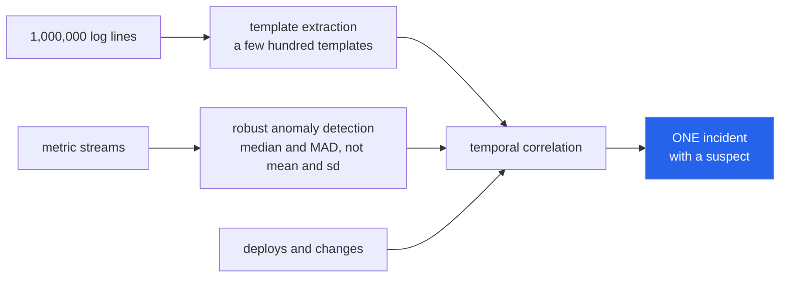

<h1 align="center">incident-copilot (Python · Drain templates · robust z-score (MAD))</h1>
<p align="center"><i>A million log lines and forty alarms reduced to one incident with a suspect</i></p>

<p align="center">
  <a href="#logs-a-million-lines-are-a-few-hundred-templates">Logs</a> &middot;
  <a href="#metrics-the-mean-and-standard-deviation-hide-the-thing-you-are-looking-for">Metrics</a> &middot;
  <a href="#correlation-one-deploy-one-incident-one-page">Correlation</a> &middot;
  <a href="#three-bugs-the-tests-caught-on-first-run">Three bugs</a> &middot;
  <a href="#limits">Limits</a> &middot;
  <a href="#problems-hit-while-building-this">Problems hit</a>
</p>

<p align="center">
  <a href="https://github.com/hammasbuilds/incident-copilot/actions/workflows/ci.yml"></a>
  
  
  <a href="LICENSE"></a>
</p>

---

## Logs: a million lines are a few hundred templates



Every algorithm here is **implemented rather than wrapped**, because the parameters that
matter are the ones you have to tune for your own systems - and you cannot tune what you
cannot see.


```
Connection to db-7 failed after 3021ms
Connection to db-2 failed after 1180ms
Connection to db-9 failed after 88ms
    →  Connection to db-<NUM> failed after <NUM>        ×3
```

Nobody can read a million lines. Everybody can read *"this template fired 40,000 times
today and has never fired before"*.

Implemented Drain-style: a fixed-depth parse tree — bucket by token count, then by the
first few tokens, then compare against the handful of candidates in that leaf. O(1)-ish
per line instead of comparing against every template ever seen, which is what makes it
work on a live stream.

`parser.match(line)` returns `None` for a line whose *shape* has never been seen. That
is frequently the first sign of a new fault, and it is invisible to keyword alerting.

## Metrics: the mean and standard deviation hide the thing you are looking for

A single large spike inflates the standard deviation enough to make itself look
ordinary. The argument is circular but decisive, so detection uses the **median and
median absolute deviation** instead, which are unaffected by up to half the data being
garbage:

```python
def test_a_single_spike_does_not_hide_itself():
    values = [10.0] * 50 + [1000.0]
    assert abs(robust_z_scores(values)[-1]) > 5
```

**Seasonality is separate.** Infrastructure metrics are strongly daily, and a detector
without it alerts every morning when traffic arrives — which is how alerting gets
switched off. Seasonal comparison checks a point against the same phase of previous
cycles, and stays silent until it has seen two complete ones, because with a single
cycle there is no "same time yesterday" to compare against.

**Drops are anomalies too.** Traffic falling to zero is an outage, and a one-sided
detector misses it entirely.

**Tiny moves are suppressed.** A 3-sigma move on a metric that barely moves is noise,
not an incident.

## Correlation: one deploy, one incident, one page

A deploy produces a latency spike, an error-rate spike, a queue-depth spike and forty
log templates firing at once. Paging someone four times about one event is how alert
fatigue starts.

```python
incident.summary()
# {"services": ["api", "db"],
#  "severity": "high",
#  "causes": ["deploy: api v2.3"],
#  "top_signals": ["api: errors high (score 9.0)", ...]}
```

Three decisions in there:

**Grouping is by gap, not fixed buckets.** A fixed window splits one incident in two
whenever it happens to straddle a boundary.

**Only changes *before* the onset can be causes.** A change afterwards is a *response* —
presenting the rollback as the cause sends the investigation backwards.

**Severity comes from breadth before strength.** One metric at 10σ on one service is
usually that service. Three services moving together is usually infrastructure.

## Three bugs the tests caught on first run

Written up because they are the useful part, and all three would have survived review:

1. **The parse tree consumed every token of short lines.** `service alpha restarted`
   and `service beta restarted` could never reach the same leaf, so no template could
   ever generalise. The prefix now stops short of the full line.
2. **A constant series lost the sign of its deviation** — so traffic dropping to zero
   was reported as `direction="high"`. An outage read as a spike.
3. **A perfectly regular seasonal pattern has MAD 0**, and the code skipped that case —
   meaning the *cleanest possible* break in a pattern was the one thing it could not
   detect.

## Tests

**39 tests. No numpy, no services, no waiting for a real incident.**

```bash
make test
```

| Covered | |
|---|---|
| Masking | IPs, UUIDs, hex, timestamps, durations, emails, paths |
| Drain | collapsing, separating, wildcards, bounded examples, unseen shapes, empty input |
| Robust stats | spike self-concealment, MAD vs outliers, constant series, short series |
| Detection | spikes, drops, normal variation, relative-change floor, no double-reporting |
| Seasonality | daily pattern not flagged, broken pattern caught, insufficient cycles |
| Correlation | grouping, gaps, cause ordering, post-onset exclusion, service scoping |
| Severity | breadth over strength, operator-readable summary |

## Layout

```
src/copilot/
  logs/drain.py           fixed-depth parse tree, masking, template matching
  metrics/anomaly.py      robust z-score, seasonal comparison, the combined detector
  correlate/incident.py   grouping, change attribution, severity
demo.py                   40 alerts in, one incident out
```

## Limits

- Correlation is temporal, not causal. It says *these happened together and this
  preceded them*, which is a lead, not a diagnosis. An operator woken at 3am needs to
  be able to check the reasoning, and a correlation they cannot check is one they will
  not trust.
- Drain's parse tree assumes the leading tokens are usually constant. Logs that vary in
  position one fragment more than they should.
- Seasonality handles one period. Daily-and-weekly together needs decomposition.
- No LLM in the core. Narrative generation belongs on top of these signals, not inside
  them — the detection has to be explainable on its own.

## Keywords

AIOps &middot; incident response &middot; log analysis &middot; log template extraction &middot; Drain &middot; anomaly detection &middot; MAD &middot; robust statistics &middot; alert correlation &middot; root cause analysis &middot; change attribution &middot; observability &middot; SRE &middot; on-call &middot; noise reduction &middot; time series

## License

MIT

---

## Run it yourself

```bash
git clone https://github.com/hammasbuilds/incident-copilot
cd incident-copilot

uv sync --all-groups     # or: pip install -e ".[dev]"
make test                # 43 tests, no numpy, no services
```

```python
from copilot.logs import DrainParser
from copilot.metrics import Detector
from copilot.correlate import ChangeEvent, Signal, correlate

# a million log lines -> a few hundred templates
parser = DrainParser()
for template in parser.parse(log_lines):
    print(f"x{template.count}  {template.text}")
parser.match(new_line)        # None means a shape never seen before

# metrics: robust to the outliers you are looking for
Detector(threshold=3.0, period=24).detect("qps", hourly_values)

# forty alarms -> one incident with a suspect
incidents = correlate(signals, changes=[
    ChangeEvent(at=deploy_time, kind="deploy", description="api v2.3", service="api"),
])
incidents[0].summary()
```

---

## Input

A synthetic alert storm with known ground truth: one bad deploy that cascades across
three services, buried in 34 unrelated background alerts. The correlator is told none
of this.


## Output

`python demo.py`


*The 34 singletons matter as much as the incident. Correlation here is transitive within
`window_seconds`, so an alert stream arriving steadily faster than the window collapses
into one incident regardless of service — a real property worth knowing before trusting
any "40 alarms became 1" claim, including this one.*

## Problems hit while building this

**A traffic drop to zero was reported as a spike.** On a series that is almost constant,
the median absolute deviation is zero, so the code took a special branch — and that
branch returned a fixed positive score, losing the *sign*. An outage arrived labelled
`direction="high"`. *Fixed* by carrying the sign through the constant-series case, with
a test asserting a drop is detected as a drop.

**The cleanest possible break in a seasonal pattern was the one case that went
undetected.** A perfectly regular daily pattern has zero variance at each phase, so the
seasonal detector hit a divide-by-zero guard and skipped the point entirely — meaning
the more reliable the pattern, the less able it was to notice the pattern breaking.
*Fixed* by treating any departure from a zero-variance phase as the signal it obviously
is.

**Short log lines could never form a template.** The parse tree used the first few
tokens as branch keys, which for a three-word line consumed the entire line — so
`service alpha restarted` and `service beta restarted` landed in different leaves and no
generalisation was possible. *Fixed* by stopping the prefix short of the full line.

All three passed a read-through and failed the first real run.

**`fastapi`, `uvicorn`, `pydantic`, `rich`, and `typer` were declared as core
dependencies since the repo's first commit and imported nowhere** — grepped `src/` and
`tests/` for every one of them to be sure before touching anything. There was also an
empty `src/copilot/api/` folder, presumably scaffolding for a service that was never
built. *Fixed* by removing all five from `dependencies` and deleting the empty folder —
the actual gap was the declared-but-unbuilt `ui` Streamlit demo, since replaced by
`demo.py`, not a REST
API this project never needed in the first place.
