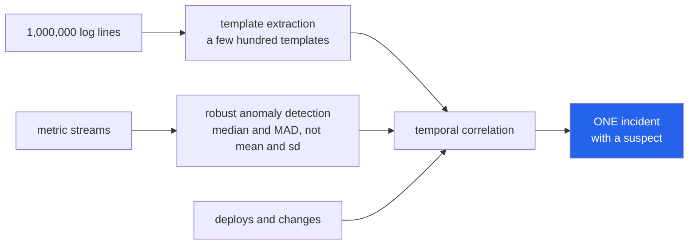

<h1 align="center">incident-copilot (Python · Drain templates · robust z-score (MAD))</h1>
<p align="center"><i>A million log lines and forty alarms reduced to one incident with a suspect</i></p>

<p align="center">
  <a href="#logs-a-million-lines-are-a-few-hundred-templates">Logs</a> &middot;
  <a href="#metrics-the-mean-and-standard-deviation-hide-the-thing-you-are-looking-for">Metrics</a> &middot;
  <a href="#correlation-one-deploy-one-incident-one-page">Correlation</a> &middot;
  <a href="#three-bugs-the-tests-caught-on-first-run">Three bugs</a> &middot;
  <a href="#limits">Limits</a> 
</p>

<p align="center">
  <a href="https://github.com/hammasbuilds/incident-copilot/actions/workflows/ci.yml"></a>
  
  
  <a href="LICENSE"></a>
</p>

---

## Logs: a million lines are a few hundred templates


```mermaid
flowchart LR
    L["1,000,000 log lines"] --> T["template extraction<br/>a few hundred templates"]
    M["metric streams"] --> AD["robust anomaly detection<br/>median and MAD, not mean and sd"]
    T --> C["temporal correlation"]
    AD --> C
    D["deploys and changes"] --> C
    C --> I["ONE incident<br/>with a suspect"]

    style I fill:#2563eb,color:#fff
```

Every algorithm here is **implemented rather than wrapped**, because the parameters that
matter are the ones you have to tune for your own systems - and you cannot tune what you
cannot see.


```
Connection to db-7 failed after 3021ms
Connection to db-2 failed after 1180ms
Connection to db-9 failed after 88ms
    →  Connection to db-<NUM> failed after <NUM>        ×3
```

`python bench.py` (200,000 synthetic lines, five shapes, random usernames/ids/numbers):

```
200,000 lines -> 5 templates in 19.2s
  x40259  user <*> logged in from <IP>
  x40232  worker <NUM> restarted after <NUM> retries
  x40107  GET <PATH>/<NUM> <NUM> <NUM>
  x39797  Connection to db-<NUM> failed after <NUM>
  x39605  cache miss for key=<*> shard=<NUM>
```

Nobody can read a million lines. Everybody can read *"this template fired 40,000 times
today and has never fired before"*.

Implemented Drain-style: a fixed-depth parse tree — bucket by token count, then by the
first few tokens, then compare against the handful of candidates in that leaf. O(1)-ish
per line instead of comparing against every template ever seen, which is what makes it
work on a live stream.

`parser.match(line)` returns `None` for a line whose *shape* has never been seen. That
is frequently the first sign of a new fault, and it is invisible to keyword alerting.

## Metrics: the mean and standard deviation hide the thing you are looking for

A single large spike inflates the standard deviation enough to make itself look
ordinary. The argument is circular but decisive, so detection uses the **median and
median absolute deviation** instead, which are unaffected by up to half the data being
garbage:

```python
def test_a_single_spike_does_not_hide_itself():
    values = [10.0] * 50 + [1000.0]
    assert abs(robust_z_scores(values)[-1]) > 5
```

**Seasonality is separate.** Infrastructure metrics are strongly daily, and a detector
without it alerts every morning when traffic arrives — which is how alerting gets
switched off. Seasonal comparison checks a point against the same phase of previous
cycles, and stays silent until it has seen two complete ones, because with a single
cycle there is no "same time yesterday" to compare against.

**The seasonal scale is pooled.** A per-phase MAD from two weeks of hourly data rests on
at most 13 samples (2-3 in the first cycles) and collapses towards zero on plain noise;
an earlier version scored a 1.8-sigma wobble at 14.5 and, in the worst seed, 100,000.
The scale is now floored by the median absolute residual pooled over every phase, and
when `period` is set the global outlier test runs on the series with each phase's median
removed. Over 200 seeds of 336 hourly points (day/night baseline 100/110, Gaussian sd 2):

| `Detector(threshold=3, period=24)` | false positives per point | per 14-day series | worst seasonal score |
|---|---:|---:|---:|
| before | 0.97% | 3.25 | 100,975 |
| after | 0.15% | 0.50 | 4.3 |

A missing daily peak (-10, i.e. 5 sigma) on the last day is still caught in 100/100 seeds,
and NaN, infinite or empty input raises a `ValueError` naming the index instead of
returning an all-clear `[]`.

**Drops are anomalies too.** Traffic falling to zero is an outage, and a one-sided
detector misses it entirely.

**Tiny moves are suppressed.** A 3-sigma move on a metric that barely moves is noise,
not an incident.

## Correlation: one deploy, one incident, one page

A deploy produces a latency spike, an error-rate spike, a queue-depth spike and forty
log templates firing at once. Paging someone four times about one event is how alert
fatigue starts.

```python
incident.summary()
# {"services": ["api", "db"],
#  "severity": "high",
#  "causes": ["deploy: api v2.3"],
#  "top_signals": ["api: errors high (score 9.0)", ...]}
```

Three decisions in there:

**Grouping is by gap, not fixed buckets.** A fixed window splits one incident in two
whenever it happens to straddle a boundary.

**Only changes *before* the onset can be causes.** A change afterwards is a *response* —
presenting the rollback as the cause sends the investigation backwards.

**A `ChangeEvent` with no `service` set is treated as global.** `correlate()` attaches it
to *any* incident in its lookback window regardless of which services are affected — the
right behaviour for a genuinely infrastructure-wide change (a CDN config, a cluster
upgrade), but a trap if you simply forgot to set `.service` on a per-service change: it
will still show up as a candidate cause for unrelated incidents. Set `service` whenever
the change is scoped to one service.

**Severity comes from breadth before strength.** One metric at 10σ on one service is
usually that service. Three services moving together is usually infrastructure.

## Three bugs the tests caught on first run

Written up because they are the useful part, and all three would have survived review:

1. **The parse tree consumed every token of short lines.** `service alpha restarted`
   and `service beta restarted` could never reach the same leaf, so no template could
   ever generalise. The prefix now stops short of the full line.
2. **A constant series lost the sign of its deviation** — so traffic dropping to zero
   was reported as `direction="high"`. An outage read as a spike.
3. **A perfectly regular seasonal pattern has MAD 0**, and the code skipped that case —
   meaning the *cleanest possible* break in a pattern was the one thing it could not
   detect.

## Tests

**59 tests. No numpy, no services, no waiting for a real incident.**

```bash
make test          # or, without make (e.g. on Windows): uv run pytest -q
```

No `make` on your machine? Nothing here depends on it — `make test`, `make lint` and
`make fmt` are one-line wrappers, and `uv run pytest -q`, `uv run ruff check src tests`,
`uv run ruff format src tests` do exactly the same thing.

| Covered | |
|---|---|
| Masking | IPs, UUIDs, hex, timestamps, durations, emails, Unix and Windows paths, scientific notation |
| Drain | usernames in the routing prefix, `key=<*>`, no over-merging, collapsing, separating, wildcards, bounded examples, unseen shapes, empty input, bad input |
| Robust stats | spike self-concealment, MAD vs outliers, constant series, short series |
| Detection | spikes, drops, normal variation, relative-change floor, no double-reporting, bad input |
| Seasonality | daily pattern not flagged, broken pattern caught, insufficient cycles, bad input, false-positive rate over 100 seeds of pure noise, NaN/empty input |
| Correlation | grouping, gaps, cause ordering, post-onset exclusion, service scoping |
| Severity | breadth over strength, operator-readable summary |

## Layout

```
src/copilot/
  logs/drain.py           fixed-depth parse tree, masking, template matching
  metrics/anomaly.py      robust z-score, seasonal comparison, the combined detector
  correlate/incident.py   grouping, change attribution, severity
demo.py                   40 alerts in, one incident out
```

## Limits

- Correlation is temporal, not causal. It says *these happened together and this
  preceded them*, which is a lead, not a diagnosis. An operator woken at 3am needs to
  be able to check the reasoning, and a correlation they cannot check is one they will
  not trust.
- Drain's parse tree routes on the leading tokens. When a variable word lands there
  (`user alice logged in`, `user=bob ...`) and the leaf has no match, the parser falls back
  to every template of the same length, so these collapse into `user <*> ...` /
  `user=<*> ...`; a miss costs a scan of those templates. Lines of different token counts
  never merge.
- Seasonality handles one period. Daily-and-weekly together needs decomposition.
- No LLM in the core. Narrative generation belongs on top of these signals, not inside
  them — the detection has to be explainable on its own.

## Keywords

AIOps &middot; incident response &middot; log analysis &middot; log template extraction &middot; Drain &middot; anomaly detection &middot; MAD &middot; robust statistics &middot; alert correlation &middot; root cause analysis &middot; change attribution &middot; observability &middot; SRE &middot; on-call &middot; noise reduction &middot; time series

## License

MIT

---

## Run it yourself

```bash
git clone https://github.com/hammasbuilds/incident-copilot
cd incident-copilot

uv sync --all-groups     # or: pip install -e ".[dev]"
make test                # 59 tests, no numpy, no services
                          # no make on Windows? uv run pytest -q does the same thing
```

```python
import random

from copilot.correlate import ChangeEvent, Signal, correlate
from copilot.logs import DrainParser
from copilot.metrics import Detector

# logs -> templates
log_lines = [f"user {u} logged in from 10.0.0.{i}" for i, u in enumerate(["ali", "zoë", "bob"])]
log_lines += [f"Connection to db-{n} failed after {ms}ms" for n, ms in [(7, 3021), (2, 1180)]]
parser = DrainParser()
for template in parser.parse(log_lines):
    print(f"x{template.count}  {template.text}")
print(parser.match("kernel panic on cpu 3"))  # None: a shape never seen before

# metrics: two weeks of hourly qps, day/night baseline, noise, one spike
rng = random.Random(0)
hourly_values = [100 + 10 * ((h % 24) > 8) + rng.gauss(0, 2) for h in range(336)]
hourly_values[300] = 400.0
for a in Detector(threshold=3.0, period=24).detect("qps", hourly_values):
    print(a.index, a.direction, a.score, a.detector)

# alarms + a deploy -> one incident with a suspect
deploy_time = 1_700_000_000.0
signals = [
    Signal(at=deploy_time + 60, service="api", kind="metric", detail="errors 0.4% -> 11%", score=9.0),
    Signal(at=deploy_time + 90, service="db", kind="metric", detail="pool exhausted", score=6.0),
]
incidents = correlate(signals, changes=[
    ChangeEvent(at=deploy_time, kind="deploy", description="api v2.3", service="api"),
])
print(incidents[0].summary())
```

Output (copied from a run):

```
x3  user <*> logged in from <IP>
x2  Connection to db-<NUM> failed after <NUM>
None
219 low 3.255 robust_z
300 high 159.577 robust_z
{'started_at': 1700000060.0, 'services': ['api', 'db'], 'signals': 2, 'severity': 'high', 'causes': ['deploy: api v2.3'], 'top_signals': ['api: errors 0.4% -> 11% (score 9.0)', 'db: pool exhausted (score 6.0)']}
```

Index 219 is a 3.3-sigma noise point, left in on purpose: at `threshold=3.0` the detector
flags about 0.15% of pure-noise points (see Metrics), which is what a 3-sigma threshold means.

Real telemetry has holes in it. A `None` in a batch of log lines, or a stray string in a
metric series, raises a `TypeError`/`ValueError` naming the offending index rather than
failing deep inside a `.strip()` or a division:

```python
>>> DrainParser().parse(["a real line", None])
TypeError: log line 1 is not a str (got NoneType instead: None); DrainParser.parse() expects an iterable of strings
>>> Detector().detect("qps", [1.0, 2.0, "oops"])
ValueError: qps[2] is not numeric (got str instead: 'oops')
```

---

## Input

A synthetic alert storm with known ground truth: one bad deploy that cascades across
three services, buried in 34 unrelated background alerts. The correlator is told none
of this.


## Output

`python demo.py`

```
INPUT
   40 alerts across 7 services
   2 change events in the lookback window

OUTPUT
   40 alerts -> 1 correlated incident, 34 unrelated singletons

   severity=critical   6 alerts   services=checkout, ledger, payments
      +  60s  checkout  metric error_rate 0.4% -> 11.2%
      +  62s  checkout  log    NullPointerException in PaymentClient
      +  75s  checkout  metric p99 latency 180ms -> 4200ms
      +  90s  payments  metric connection_pool_exhausted
      +  95s  payments  log    timeout awaiting connection
      + 120s  ledger    metric write_queue_depth 12 -> 3100
      SUSPECT   deploy: checkout v4.12.0  (+30s)

   The other 34 alerts stayed separate. They are background noise,
   and nothing in the correlator was told which was which.
```


*The 34 singletons matter as much as the incident. Correlation here is transitive within
`window_seconds`, so an alert stream arriving steadily faster than the window collapses
into one incident regardless of service — a real property worth knowing before trusting
any "40 alarms became 1" claim, including this one.*
